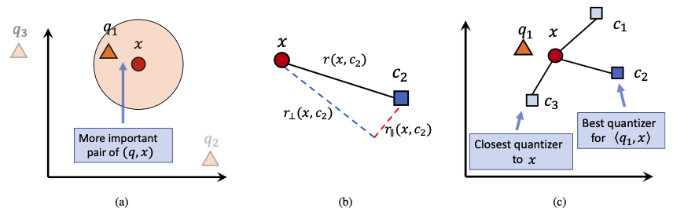
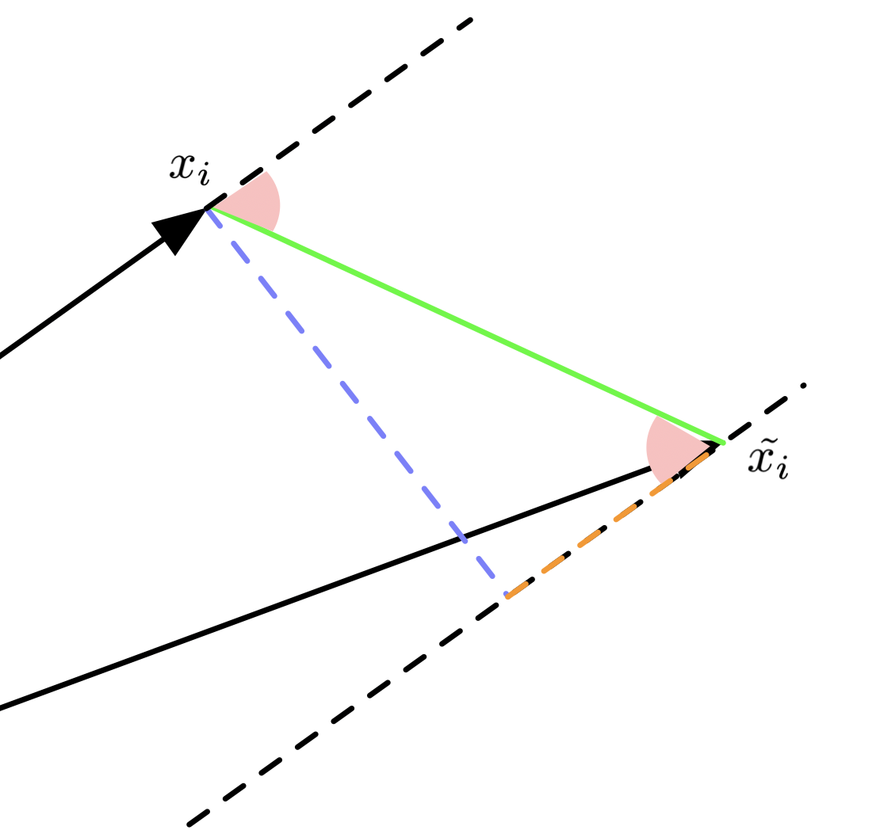
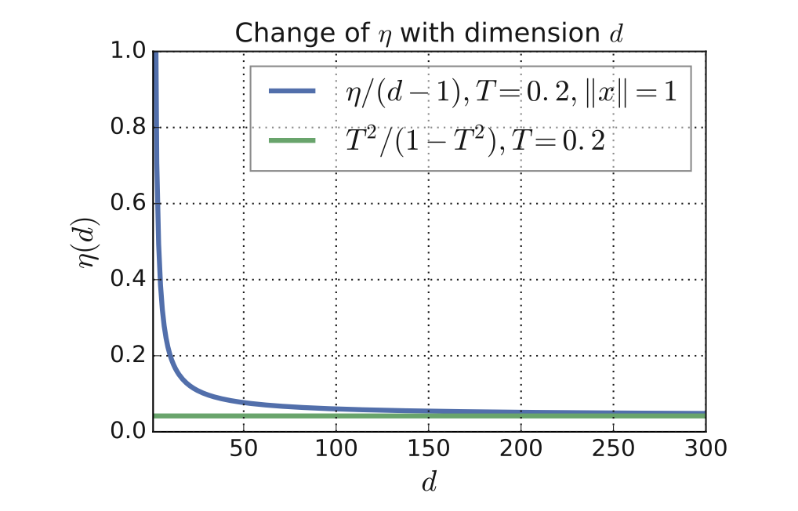
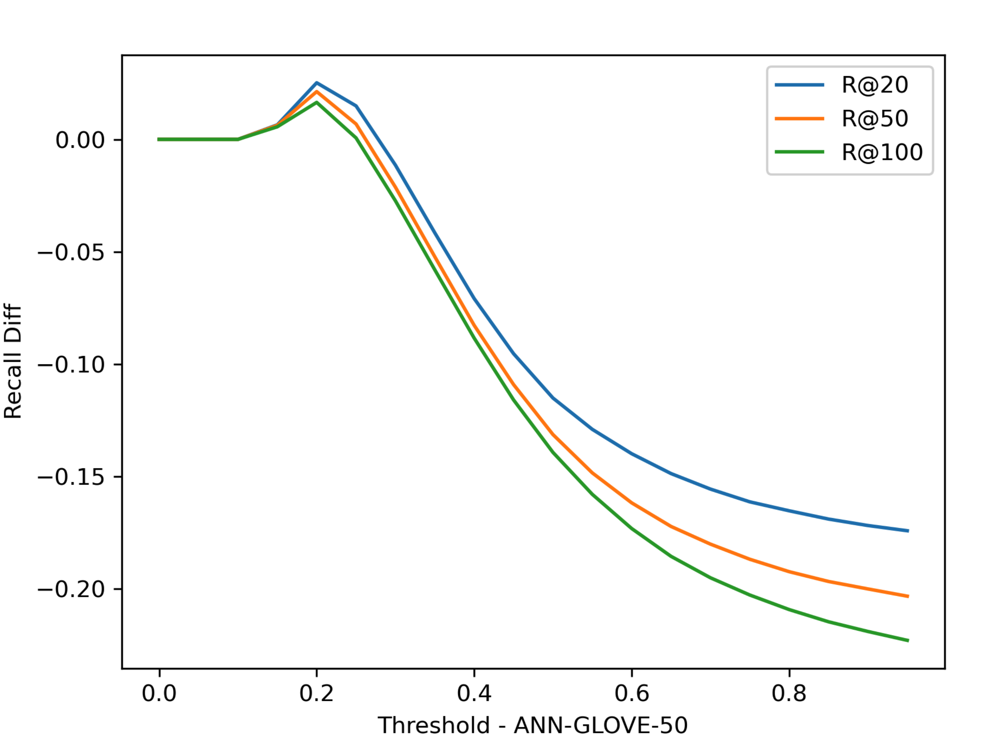
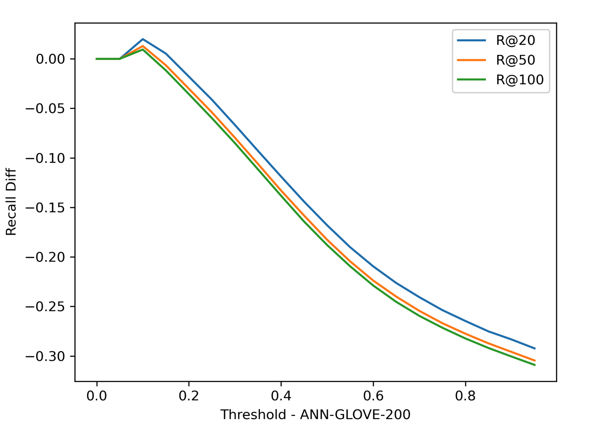
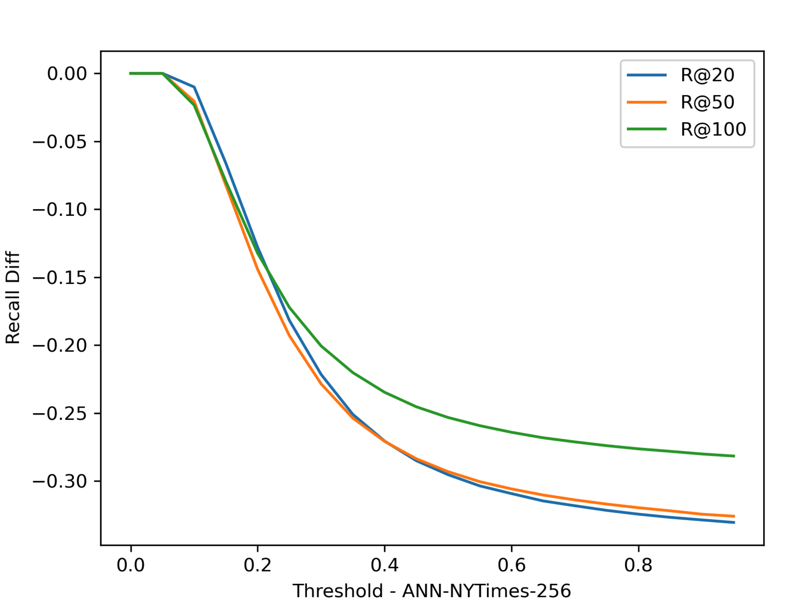
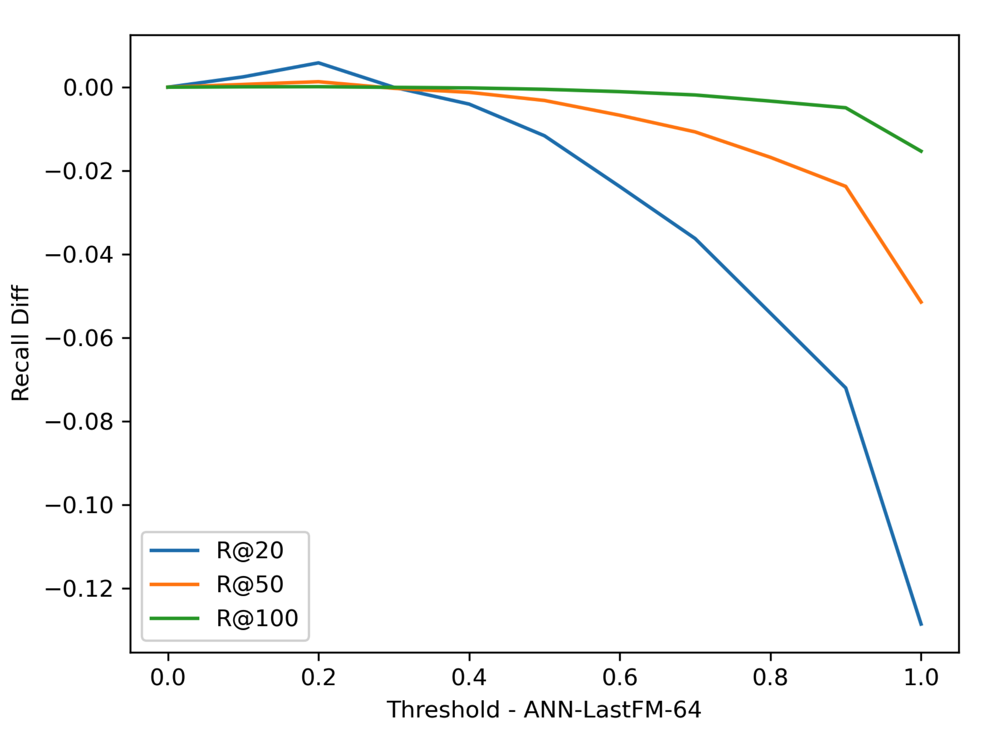

# 深入理解 ScaNN 

作为近年在 InnerProduct ANNS 任务上的 SOTA，Google 的这篇 [ScaNN](http://proceedings.mlr.press/v119/guo20h/guo20h.pdf) 包含了这几年来在为 ANNS 服务的向量量化方面研究相关工作的一些经典思想。所以我们在这里也希望能站在巨人肩膀上看世界，清晰了解 ScaNN 的技术细节。

本片工作主要作用于 MIPS（Maximum Inner Product Search），当然我们可以把很多搜索问题都归结于最大内积搜索上。

1. 最小欧氏距离搜索：$\|a-b\|^2:=\|a\|^2-2\langle a,b\rangle + \|b\|^2$
2. 最小余弦距离搜索：$\text{cos}(\angle_{a,b})=\frac{\langle a, b\rangle}{\|a\|\|b\|}$

也就是说，如果我们提出更好的改善 MIPS 的方法，就也许有推广到更多度量上的可能。

文章中也将提速优化的方法分为了以下两种：

1. 量化：SQ, PQ, RQ: (AQ, LSQ)
2. 减少计算：对应 Non-exhaustive Search。分为 TreeSearch 和 LocalitySenstiveHash。当然还包括 HNSW。

## Problem Formulation

通常来讲，量化的目标都是在减少内积在量化前后的误差。具体可以写作：

$$\mathbb{E}_q\sum_{i=1}^n\Big(\langle q,x_i\rangle - \langle q, \tilde{x_i}\rangle\Big)^2=\mathbb{E}_q\sum_{i=1}^n\Big(\langle q,x_i- \tilde{x_i}\rangle\Big)^2$$
当然我们可以假设这里的 $q$ 是[各向同性的（isotropic）](https://en.wikipedia.org/wiki/Isotropic_position)。也就是说 $\mathbb{E}_q[qq^T]=cI$。那么进一步化简就可以得到 

$$\begin{aligned} \mathbb{E}_q\sum_{i=1}^n\Big(\langle q,x_i- \tilde{x_i}\rangle\Big)^2&=\sum_{i=1}^{n}\mathbb{E}_q(x_i-\tilde{x_i})^Tqq^T(x_i-\tilde{x_i})\\ \text{With respect to }&\mathbb{E}_q[qq^T]=cI\text{,}\\ &=c\sum_{i=1}^n\|x_i-\tilde{x_i}\|^2 \end{aligned}$$

我们首先要理解什么叫 isotropic。因为这个问题对于 ScaNN 非常重要，这个性质是之后所有推断的基石。如果在真实数据上观测不到这个性质，我们就需要操作数据或者模型让他满足这个性质。这里讲的 isotropic，或者文章中所说的 isotropic vectors，是指落在 [isotropic position](https://arxiv.org/pdf/math/9608208.pdf) 的向量，也就是分布的协方差等于单位矩阵。均匀分布在 unit sphere 上的 向量都属于 isotropic 的。同时，均匀分布在单位球中的向量也都是属于 isotropic positions 的。其实各向同性的这个概念是从物理学科借过来的。在物理上我们可能用描述折射率、电阻率、强度等等描述他的各向异性或者是各向同性。在数学上我们用概率密度来描述这个性质：也就是说满足各向同性的向量场在各个方向上的边缘概率分布都是相同的，或者 $\varepsilon$-相同，我们称他们为各向同性或者 $\varepsilon$-各向同性。要注意 ScaNN 要求查询向量满足这个性质。

## Score-Aware Quantization Loss

作者认为不是所有的样本都对与量化向量有用。作者认为对于给定的向量 $q$ ，与 $x$ 内积越大，其量化误差就越有意义，如图 (a) 所示。量化的本质实际上是寻找在同空间中较少数量的向量集合描述原有向量的概率分布。向量会塌缩至临近的描述向量 / 类中心 $c$ 上。那么作者将量化误差分解成了正交分量 $r_{\perp}$ 和平行分量 $r_\parallel$, 如图 (b) 所示。同时作者指出，最近的类中心也许并不是对内积最好的描述，我们应该关注内积最接近的作为描述向量，如图 (c) 所示。

原文中的图画的不是很好，有点太过抽象了。为了方便推导，我重新画了一个图：

看到右图，绿色是 $(x_i-\tilde{x_i})$， 蓝色是 $r_\perp$，橙色是 $r_\parallel$ 。红色的角我们记作 $\angle_{x_i, x_i-\tilde{x_i}}$。
两个红色的角相等，我们就可以使用 $\text{cos}\angle_{x_i,x_i-\tilde{x_i}}$ 来求 $r_\parallel$ 。

求 $r_\parallel$ 相当于在求 $(x_i-\tilde{x_i})$ 在 $\frac{x_i}{\|x_i\|}$ 上的投影。
那么就可以得到 

$$\begin{aligned} r_\parallel &= \|x_i-\tilde{x_i}\|\text{cos}\angle_{x_i,x_i-\tilde{x_i}} \frac{x_i}{\|x_i\|}\\ &=\|x_i-\tilde{x_i}\| \frac{\langle x_i, x_i-\tilde{x_i} \rangle}{\|x_i-\tilde{x_i}\|\|x_i\|} \frac{x_i}{\|x_i\|}\\ &=\frac{\langle x_i, x_i-\tilde{x_i} \rangle x_i}{\|x_i\|^2} \end{aligned}$$

具体的可以参考 [Wikipedia](https://en.wikipedia.org/wiki/Vector_projection#Vector_projection_2) 。

同时也不难得到，[Vector Rejection](https://en.wikipedia.org/wiki/Vector_projection#Vector_rejection_2) 也就是垂直分量为
$$r_\perp=(x_i-\tilde{x_i}) - r_\parallel=(x_i-\tilde{x_i}) - \frac{\langle x_i, x_i-\tilde{x_i} \rangle x_i}{\|x_i\|^2}$$
到了这里，我们就可以继续使用 $r_\parallel$ 和 $r_\perp$ 对 score-aware loss 进行推导了。

### Some Derivations on Theorems

文章涉及到了三个定理，我们在这里做详细讨论

#### **定理 3.2：**

**假设我们有一个给定的 $xi​$ ，和他的量化结果 $\tilde{x_i}$​ 以及权重函数 $w$ 。对于均匀分布 在 $(d−1)$-球面 ($(d−1)$-Sphere) 上的 query $q$.  Score-aware Quantization Loss 可以被简化为**

$$\begin{aligned} \mathcal{L}(x_i, \tilde{x_i}, w) = &h_\parallel(w, \|x_i\|)\big\|r_\parallel(x_i, \tilde{x_i})\big\|^2 \\ &+ h_\perp(w, \|x_i\|)\big\|r_\perp(x_i, \tilde{x_i}) \big\|^2 \end{aligned}$$

**其中 $h_\parallel$​ 和 $h_\perp$ 可以被定义为** 

$$\begin{aligned} h_\parallel &:= (d-1)\int_0^\pi w(\|x_i\|\cos\theta)(\sin^{d-2}\theta-\sin^d\theta)d\theta\\ h_\perp &:=\int_0^\pi w(\|x_i\|\cos\theta)\sin^d\theta d\theta\\ \end{aligned}$$

**证明：（原文附录 7. 1 内容）**

在给定 $x$ 的情况下，可以把 loss 写作条件期望的形式。 令 $t:=\langle q,x\rangle$，通过把 $q$ 分解成 $x$ 方向和正交方向，可以将 loss 的一部分写作：

$$\begin{aligned} \mathbb{E}_q\Big[\langle q, x-\tilde x \rangle^2 \, | \,\langle q, x\rangle=t\Big] &=\mathbb{E}_q\Big[\langle q_\parallel + q_\perp, r_\parallel(x, \tilde x) + r_\perp(x, \tilde x) \rangle^2 \, | \,\langle q, x\rangle=t\Big]\\ &=\mathbb{E}_q\Big[\big(\langle q_\parallel, r_\parallel(x, \tilde x)\rangle+\langle q_\perp, r_\perp(x, \tilde x) \rangle + 0 + 0\big)^2\, | \,\langle q, x\rangle=t\Big]\\ &=\mathbb{E}_q\Big[\langle q_\parallel, r_\parallel(x, \tilde x)\rangle^2\, | \,\langle q, x\rangle=t\Big]+\mathbb{E}_q\Big[\langle q_\perp, r_\perp(x, \tilde x) \rangle^2\, | \,\langle q, x\rangle=t\Big] + 0\\ \end{aligned}$$

这里注意几个点，正交的两个向量内积为零。所以在推导过程中我故意占位了 0 来表示之前有对应的项。由于期望在 $q$ 上完成，所以我们可以把对应的 $r_\parallel(x,\tilde x)$ 和 $r_\perp(x,\tilde x)$ 当作常数从期望中拿出来。同时，由于我们已经给定了 $t:=\langle q,x\rangle$，所以不难得到 $\|q_\parallel\|:=\frac{t}{\|x\|}$​。 类似地，由于 $\|q\|^2 = \|q_\parallel\|^2 + \|q_\perp\|^2$ ，假设 $\|q\|=1$ 的情况下我们可以得到 $\|q_\perp\|=\sqrt{1-\frac{t^2}{\|x\|^2}}$​ 。另外，我们假设了 $q$ 是 $(d−1)$-球面 上均匀分布的向量，所以我们可以得到 $\mathbb{E}_q\big[\|q_\perp\|^2\big]=\frac{1-\frac{t^2}{\|x\|^2}}{d-1}$ 。因此我们整理上面公式为

$$\text{Right} = \frac{t^2}{\|x\|^2}\Big\|r_\parallel(x,\tilde x)\Big\|^2 + \frac{1-\frac{t^2}{\|x\|^2}}{d-1}\Big\|r_\perp(x, \tilde x)\Big\|^2$$

将上式代入 Score aware loss，再加入一些 $\|q\|=1$ 的特殊风味（确定了上下界）可得

$$\begin{aligned} \mathcal{L}(x_i,\tilde{x_i},w)&=\int_{-\infty}^{\infty}w(t)\mathbb{E}_q\Big[\langle q,x_i-\tilde{x_i}\rangle^2\,|\,\langle q,x\rangle=t\Big]p\big(\langle q,x\rangle= t\big)dt\\ &=\int_{-\|x_i\|}^{\|x_i\|}w(t)\mathbb{E}_q\Big[\langle q,x_i-\tilde{x_i}\rangle^2\,|\,\langle q,x\rangle=t\Big]dP\big(\langle q,x\rangle\le t\big)\\ \end{aligned}$$

我们定义 $\theta:=\arccos \frac{t}{\|x_i\|}$，所以可以得到 $t$ 的另一种表示 $t=\|x_i\|\cos\theta$ 同时也可以得到 

$$\sin\theta=\sqrt{1-\cos^2\theta}=\sqrt{1-\frac{t^2}{\|x_i\|^2}}$$

而上面的 $\sin\theta$ 正好是 $\|q_\perp\|$。这里我们稍微复习一下 [Hypersphere](https://en.wikipedia.org/wiki/N-sphere#Closed_forms) 的一些知识。根据积分我们可以推导得到 $d$-ball 的对应的 $(d−1)$-球面的面积为 

$$S_{d-1}(R)=\frac{2\pi^{\frac{d}{2}}}{\Gamma(\frac{d}{2})}R^{d-1}= S_{d-1}R^{d-1}$$

所以可以得到 $S_{d-1}(R)=\frac{2\pi^{\frac{d}{2}}}{\Gamma(\frac{d}{2})}R^{d-1}= S_{d-1}R^{d-1}$ ，对其求导可得 $\frac{dP(\langle q,x\rangle\le t)}{dt}\propto R^{d-2}=\sin^{d-2}\theta$ 。因此代入损失函数可得

$$\begin{aligned} \mathcal{L}(x_i,\tilde{x_i},w)&=\int_{0}^{\pi}w(\|x_i\|\cos\theta)\mathbb{E}_q\Big[\langle q,x_i-\tilde{x_i}\rangle^2\,|\,\langle q,x\rangle=\|x_i\|\cos\theta\Big]\sin^{d-2}\theta d\theta\\ &=\int_{0}^{\pi}w(\|x_i\|\cos\theta)\Bigg(\frac{t^2}{\|x\|^2}\Big\|r_\parallel(x,\tilde x)\Big\|^2 + \frac{1-\frac{t^2}{\|x\|^2}}{d-1}\Big\|r_\perp(x, \tilde x)\Big\|^2\Bigg) \sin^{d-2}\theta d\theta\\ &=\int_{0}^{\pi}w(\|x_i\|\cos\theta)\Bigg(\cos^2\theta\Big\|r_\parallel(x,\tilde x)\Big\|^2 + \frac{\sin^2\theta}{d-1}\Big\|r_\perp(x, \tilde x)\Big\|^2\Bigg) \sin^{d-2}\theta d\theta\\ &=\Big\|r_\parallel(x,\tilde x)\Big\|^2\int_{0}^{\pi}w(\|x_i\|\cos\theta)(1-\sin^2\theta)\theta\sin^{d-2}\theta d\theta\\  &\;\;\;\;+ \Big\|r_\perp(x, \tilde x)\Big\|^2 \frac{1}{d-1}\int_{0}^{\pi}w(\|x_i\|\cos\theta)\sin^{d}\theta d\theta\\ &=\frac{1}{d-1}\Big\|r_\parallel(x,\tilde x)\Big\|^2 h_\parallel(w, x_i) + \frac{1}{d-1}\Big\|r_\perp(x, \tilde x)\Big\|^2 h_\perp(w, x_i)  \end{aligned}$$

*(笔者注：这里作者在 [arxiv.org 版本上](ttps://arxiv.org/pdf/1908.10396.pdf)可能有笔误 Appendix 中的 Cumulative distribution 形式写成了 Density distribution 形式。)*

至此证毕 $\blacksquare$

#### **定理 3.3：**

**对于一个单调非递减的函数 $w(t)$ ，在 $t\ge0$ 上满足** 

$$h_\parallel(w,\|x_i\|)\ge h_\perp(w, \|x_i\|)$$

**同时当且仅当 $w(t)$ 为常数时，$h_\parallel(w,\|x_i\|)= h_\perp(w, \|x_i\|)$ 其中 $t\in\Big[-\|x_i\|,\|x_i\|\Big]$。**

证明：通常地，我们在证明大小关系都会将问题转换为比例来推导。这里我们需要证明 $\frac{h_\parallel(w,\|x_i\|)}{h_\perp(w, \|x_i\|)} \ge 1$ 。我们可以列出

$$\newcommand\ddfrac[2]{\frac{\displaystyle #1}{\displaystyle #2}} \begin{aligned}  \frac{h_\parallel(w,\|x_i\|)}{h_\perp(w, \|x_i\|)} &=\ddfrac{\int_{0}^{\pi}w(\|x_i\|\cos\theta)(1-\sin^2\theta)\theta\sin^{d-2}\theta d\theta}{\frac{1}{d-1}\int_{0}^{\pi}w(\|x_i\|\cos\theta)\sin^{d}\theta d\theta}\\  &=(d-1)\Bigg(\ddfrac{\int_{0}^{\pi}w(\|x_i\|\cos\theta)\theta\sin^{d-2}\theta d\theta}{\int_{0}^{\pi}w(\|x_i\|\cos\theta)\sin^{d}\theta d\theta} - 1\Bigg)\ge 1\\ &\Leftrightarrow \ddfrac{\int_{0}^{\pi}w(\|x_i\|\cos\theta)\theta\sin^{d-2}\theta d\theta}{\int_{0}^{\pi}w(\|x_i\|\cos\theta)\sin^{d}\theta d\theta} \ge \frac{d}{d-1} \end{aligned}$$

我们不妨设 $I_d:=\int_0^\pi w(\|x_i\|\cos\theta)\sin^d\theta d\theta$ ，我们只需要证明 $\frac{I_{d-2}}{I_d}\ge\frac{d}{d-1}$​ 即可。使用分部积分法展开 $I_d$​，不难得到

$$\newcommand\ddfrac[2]{\frac{\displaystyle #1}{\displaystyle #2}} \begin{aligned}  I_d=&-\int_0^\pi w(\|x_i\|\cos\theta)\sin^{d-1}\theta d \cos\theta\\ =&-w(\|x_i\|\cos\theta)\cos\theta\sin^{d-1}\theta\Big|^\pi_0+\int_0^\pi\cos\theta d w(\|x_i\|\cos\theta)\sin^{d-1}\theta\\ =&-w(\|x_i\|\cos\theta)\cos\theta\sin^{d-1}\theta\Big|^\pi_0\\ &+\int_0^\pi\cos\theta\Big[-w'(\|x_i\|\cos\theta)\|x_i\|\sin\theta\sin^{d-1}\theta+(d-1)w(\|x_i\|\cos\theta)\cos\theta\sin^{d-2}\theta\Big]d\theta\\ =&-w(\|x_i\|\cos\theta)\cos\theta\sin^{d-1}\theta\Big|^\pi_0\\ &-\|x_i\|\int_0^\pi w'(\|x_i\|\cos\theta)\cos\theta\sin^{d}\theta d\theta+(d-1)\int_0^\pi w(\|x_i\|\cos\theta)\cos^2\theta\sin^{d-2}\theta d\theta\\ =&-w(\|x_i\|\cos\theta)\cos\theta\sin^{d-1}\theta\Big|^\pi_0\\ &-\|x_i\|\int_0^\pi w'(\|x_i\|\cos\theta)\cos\theta\sin^{d}\theta d\theta+(d-1)\int_0^\pi w(\|x_i\|\cos\theta)(1-\sin^2\theta)\sin^{d-2}\theta d\theta \end{aligned}$$

*(笔者注：对应 Appendix 7.2 ，原文跳过过多步骤。可以参考上面的推导。)*

聪明的小朋友可能看到了最后一项很眼熟。根据定义，我们可以将最后一项拆成 $(d-1)(I_{d-2}-I_{d})$ ，所以我们有

$$\newcommand\ddfrac[2]{\frac{\displaystyle #1}{\displaystyle #2}} \begin{aligned}  I_d=&-w(\|x_i\|\cos\theta)\cos\theta\sin^{d-1}\theta\Big|^\pi_0\\ &-\|x_i\|\int_0^\pi w'(\|x_i\|\cos\theta)\cos\theta\sin^{d}\theta d\theta+(d-1)(I_{d-2}-I_d) \end{aligned}$$

*(笔者注：原文 Appendix 7.2 中公式有误，丢掉了前面的第一项。请读者注意。)*

同时，我们可以看到第一项等于 0 。因为 $\sin0=0$ ，同时在 $t\le0$ 条件下，$w(t)=0$ 。因此走到这一步，我们不妨设 

$$R:=\|x_i\|\int_0^\pi w'(\|x_i\|\cos\theta)\cos\theta\sin^{d}\theta d\theta$$

所以整个的公式可以写作

$$\newcommand\ddfrac[2]{\frac{\displaystyle #1}{\displaystyle #2}} \begin{aligned}  I_d &= -R + (d-1)(I_{d-2}-I_d)\\ I_d &= -R + (d-1)I_{d-2}+(1-d)I_d\\ d I_d &= -R + (d-1)I_{d-2}\\ d &=-\frac{R}{I_d} + (d-1)\frac{I_{d-2}}{I_d}\\ \frac{d}{d-1} &=\frac{I_{d-2}}{I_d}-\frac{R}{(d-1)I_d}\\ \end{aligned}$$

我们需要证明 $\frac{R}{I_d} \ge 0$， 这样就可以得到 ​$\frac{d}{d-1} \le \frac{I_{d-2}}{I_d}$ ​。在保证 $w'(t)\ge0$ ，也就是 $w$ 单调非递减的条件下，能保证 $\|x_i\|\int_0^\pi w'(\|x_i\|\cos\theta)\cos\theta\sin^{d}\theta d\theta \ge 0$ 。这样就能得到 $R\ge 0$ 的结论，同时要求 $w$ 单调非递减的同时非正值时为零。相似地，也不难证明 $I_d\ge0$ 。我们就能证明 $\frac{I_{d-2}}{I_d}\ge\frac{d}{d-1}$ 。

同时，不难发现，等值发生在 $R=0$ 的时候出现。也就是在 $w'(t)=0$ 的时候，意味着等值出现在 $w(\cdot)$ 为常数的时候。$\blacksquare$

#### 定理 3.4：

进入到定理 3.4 前需要有一些推导来表明为什么要证明这样的事情。我们可以考虑在 $w(t)=I(t\ge T)$ 时将损失函数化简为：

$$\begin{aligned} \mathcal{L}(x_i, \tilde{x_i}, w)&=h_\parallel(w, \|x_i\|)\Big\|r_\parallel(x_i, \tilde{x_i})\Big\|^2 + h_\perp(w, \|x_i\|)\Big\|r_\perp(x_i, \tilde{x_i})\Big\|^2\\ &\propto \eta(w, \|x_i\|)\Big\|r_\parallel(x_i, \tilde{x_i})\Big\|^2 + \Big\|r_\perp(x_i, \tilde{x_i})\Big\|^2 \end{aligned}$$

其中 $\eta(w(\cdot), \|x_i\|)  := \frac{h_\parallel(w(\cdot), \|x_i\|)}{h_\perp(w(\cdot), \|x_i\|)}$​。我们可以考虑特殊情况，当 $w(t):= I(t\ge T) =  \begin{cases} 1,  &t \ge T\\ 0,  &t < T \end{cases}$ 时，有

$$\lim_{d\to\infty}\frac{\eta\Big(I(t\ge T), \|x_i\|\Big)}{d-1}=\frac{(T/\|x_i\|)^2}{1-(T/\|x_i\|)^2}$$

成立。

证明：

继续利用 [定理 3.3：](#定理-33)的证明中的中间结果来推理。我们不妨设 $I_d:=\int_0^\alpha \sin^d\theta d\theta$，其中 $\alpha:=\arccos\frac{T}{\|x_i\|}$, 这时 我们可以得到 $R:=\cos\alpha\sin^{d-1}\alpha$（对应之前我们消去的第一项）。因此我们有

$$\begin{aligned} dI_{d}&=(d-1)I_{d-2}-\cos\alpha\sin^{d-1}\alpha\\ 1&=\frac{(d-1)}{d}\frac{I_{d-2}}{I_d}-\frac{\cos\alpha\sin^{d-1}\alpha}{dI_d}\\ \end{aligned}$$

根据积分形式的柯西不等式和并结合 $I_d$ ​定义，我们有

$$\begin{aligned} \Big(\int_0^\alpha\sin^{\frac{d+2}{2}}\theta\sin^{\frac{d-2}{2}}\theta d\theta\Big)^2 &\le \int_0^\alpha\sin^{d+2}\theta d\theta\int_0^\alpha \sin^{d-2}\theta d\theta\\ {I_d}^2 &\le I_{d+2}I_{d-2}\\ \frac{I_d}{I_{d-2}}&\le\frac{I_{d+2}}{I_d} \end{aligned}$$

上面证明了 $\frac{I_{d-2}}{I_d}$ 是一个单调非递增的序列（注意在要确保 $I_d$​ 非零）。在 $w(t):= I(t\ge T)$ 的条件下，我们可以得到 $\frac{I_d}{I_{d-2}} > 1$ 。所以 $\lim_{d\to\infty}\frac{I_d}{I_{d+2}}$ 存在。结合 $\frac{I_{d-2}}{I_d}=\frac{d}{d-1}$ （在 $w$ 为常数的条件下），我们可以得到

$$\begin{aligned} 1&=\lim_{d\to\infty}\frac{\frac{(d-1)}{d}\frac{I_{d-2}}{I_d}-\frac{\cos\alpha\sin^{d-1}\alpha}{dI_d}}{\frac{(d-3)}{d-2}\frac{I_{d-4}}{I_{d-2}}-\frac{\cos\alpha\sin^{d-3}\alpha}{(d-2)I_{d-2}}}\\ 1&=\frac{\lim_{d\to\infty}\frac{(d-1)}{d}\frac{I_{d-2}}{I_d}-\lim_{d\to\infty}\frac{\cos\alpha\sin^{d-1}\alpha}{dI_d}}{\lim_{d\to\infty}\frac{(d-3)}{d-2}\frac{I_{d-4}}{I_{d-2}}-\lim_{d\to\infty}\frac{\cos\alpha\sin^{d-3}\alpha}{(d-2)I_{d-2}}}\\ 1&=\frac{\lim_{d\to\infty}\frac{(d-1)}{d}\frac{I_{d-2}}{I_d}-\lim_{d\to\infty}\frac{\cos\alpha\sin^{d-1}\alpha}{dI_d}}{\lim_{d\to\infty}\frac{(d-3)}{d-2}\frac{I_{d-4}}{I_{d-2}}-\lim_{d\to\infty}\frac{\cos\alpha\sin^{d-3}\alpha}{(d-2)I_{d-2}}}\\ 1&=\frac{1-\lim_{d\to\infty}\frac{\cos\alpha\sin^{d-1}\alpha}{dI_d}}{1-\lim_{d\to\infty}\frac{\cos\alpha\sin^{d-3}\alpha}{(d-2)I_{d-2}}}\\ 1&=\frac{\lim_{d\to\infty}\frac{\cos\alpha\sin^{d-1}\alpha}{dI_d}}{\lim_{d\to\infty}\frac{\cos\alpha\sin^{d-3}\alpha}{(d-2)I_{d-2}}}\\ \end{aligned}$$

经过化简后，我们可以简单得到 

$$\lim_{d\to\infty}\frac{(d-2)I_{d-2}}{dI_d}=\frac{1}{\sin^2\alpha}=\lim_{d\to\infty}\frac{I_{d-2}}{I_d}$$

。由于 $\eta\Big(I(t\ge T), \|x_i\|\Big) = (d-1)(\frac{I_{d-2}}{I_d}-1)$，因此 

$$\lim_{d\to\infty}\frac{\eta\big(I(t\ge T), \|x_i\|\big)}{d-1}=\frac{1}{\sin^2\theta}-1=\frac{(T/\|x_i\|)^2}{1-(T/\|x_i\|)^2}\qquad\blacksquare$$

## Application to Score-aware Quantization Techniques

作者首先使用 [K-means](https://en.wikipedia.org/wiki/K-means_clustering) 解决优化问题。不过在优化过程中，作者将原本的 K-means 目标函数

$$\min_{c_1,c_2,...,c_k\in\mathbb{R}^d}\sum_{i=1}^n\min_{\tilde{x_i}\in\{c_1,c_2,...,c_k\}}\|x_i-\tilde{x_i}\|^2$$

替换为了上文提出的 “Anisotropic Vector Quantization” 损失函数

$$\min_{c_1,c_2,...,c_k\in\mathbb{R}^d}\sum_{i=1}^n\min_{\tilde{x_i}\in\{c_1,c_2,...,c_k\}}h_{(i,\parallel)}\Big\|r_\parallel(x_i, \tilde{x_i})\Big\|^2+h_{(i,\perp)}\Big\|r_\perp(x_i, \tilde{x_i})\Big\|^2$$

作者使用 [Lloyd 算法](https://en.wikipedia.org/wiki/Lloyd%27s_algorithm)对目标求解。同时作者也将更新目标函数的 K-means 应用到了 PQ 上。到这里就完成了 ScaNN 的讲解。
[ScaNN KMeans 实现](https://github.com/google-research/google-research/blob/939cacb01818773926519dac88beb28bae05c044/scann/scann/utils/gmm_utils.cc#L670)

## Experiments

### Threshold T 对于 Recall @ R 的影响

[返回首页](https://mpskex.github.io/index)