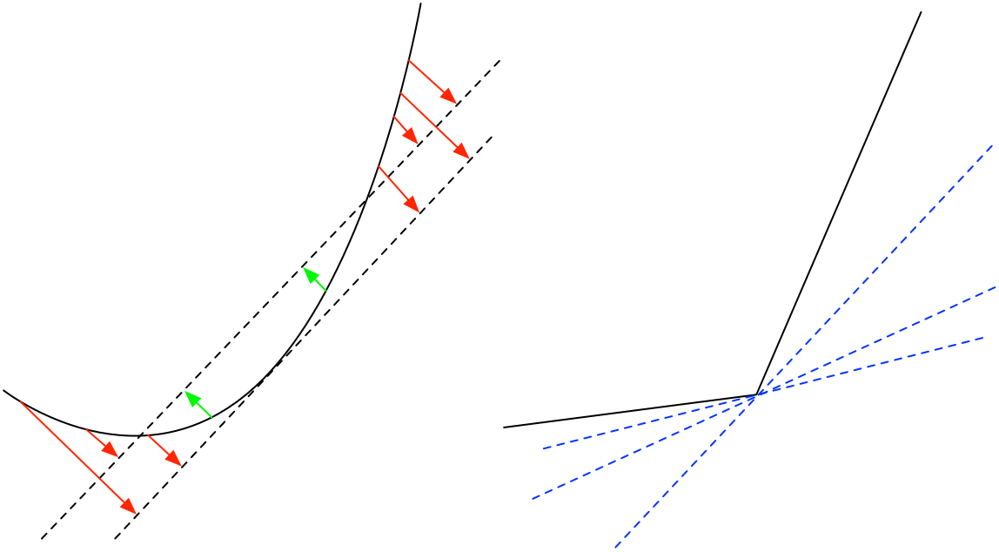

# 次梯度及其性质

本节我们主要来简单介绍一下什么是 **次梯度 （Subgradient）**。实际上，**次梯度** 就是更加泛化的**梯度（Gradient）**概念：对于一些特定的不可微函数，我们仍然可以找到一个类似梯度的定义来描述函数值变化的程度。这样就把我们的分析对象从可微函数扩展到了**真函数 （proper）**上了。

NB：关于次梯度的标记 （notation）在学术界还有歧义。我们遵循 [Amir Beck](https://scholar.google.com.hk/citations?hl=en&user=KMpBQcIAAAAJ) 的 [First Order Methods in Optimization](http://archive.siam.org/books/mo25/) 中的 $\partial f$ 来标记次梯度。

### 次梯度的定义

***（次梯度的定义）***对于一个真函数（忘记定义的同学可以参考之前的内容）$f:x\to(-\infty,\infty]$，有次梯度：

$$
\partial f(x):=\{g\in X|f(x)+ \langle g,y-x\rangle\le f(y)\qquad \forall y\in X\}
$$

这个定义可能又一点难以理解，我们不妨更加感性地认识到底什么是次梯度：

我们先复习一下对于传统梯度的定义，一条斜率为 $g$ 且过 $\big(x,f(x)\big)$ 的直线与函数有且只有一个交点。如下左图所示，切线应该对于函数来说有且只有一个焦点。但是对于有些带有间断点的函数，从传统梯度来讲并不可微，但实际上存在次梯度：**所有过点 $\big(x,f(x)\big)$ 且与函数有且只有一个交点的直线的集合组成了次梯度**，如下右图所示。所以**我们可以把次梯度理解为一个梯度的集合**，而**可微函数就是它的一个特殊形式**，就是 $\partial f = \{\nabla f\}$。

***（次梯度的定义域）***如果 $x$ 不在真函数 $f$ 的定义域或 $f(x) = +\infty$ 那么 $\partial f(x) = \phi$。因此我们定义：

$$
\operatorname{dom}\partial f:=\{x\in X | \partial f(x)\ne\phi\}
$$

所以，$\operatorname{dom}\partial f\subseteq \operatorname{dom}f$。

***(最优解条件）（Optimality Condition）***

$$
0\in\partial f(x^*) \Leftrightarrow \text{$x^*$ 是 $f$ 的最小解.}
$$

这个条件很好推导：

$$
\begin{aligned}f(x^*)&\le f(x)\qquad (\forall x\in X)\\ f(x^*)+\langle 0,x^*-x\rangle&\le f(x)\\0&\in\partial f(x^*) \qquad \blacksquare\end{aligned}
$$

一个比较好理解的例子就是 $y=|x|$。我们可以简单写一下这个函数的次梯度：

$$
\partial|x|=\begin{cases} 1 \qquad x>0\\ [-1,1]\qquad x=0\\ -1 \qquad x<0\end{cases}
$$

可以看到 $0\in\partial |x|$ ，因此绝对值最小的解是 0。

### 次梯度的一些性质

次梯度是闭合且凸的。

证明：假设次梯度不为空集，我们从次梯度 $\partial f$ 中定义一个序列 $(g_n)$，使得 $g_n\to g$ 。

（闭合性）对于所有的 $y\in X$，$f(x)+\langle g_n, y-x\rangle\le f(y)$ 。 当 $n\to\infty$ 时，有 $f(x)+\langle g, y-x\rangle\le f(y)$。因此边界 $g\in\partial f$，次梯度为闭合集合。

（凸性）定义 $g_0,g_1 \in \partial f(x)$ ，对于 $\lambda \in [0,1]$，我们有

$$
\begin{aligned} \lambda f(x)+\lambda\langle g_0, y-x\rangle+(1-\lambda)f(x)+(1-\lambda)\langle g_1, y-x\rangle &\le f(y)\\ f(x) + \langle \lambda g_0+(1-\lambda)g_1, y-x\rangle&\le f(y)\\\Leftrightarrow \big(\lambda g_0 +(1-\lambda)g_1\big)\in\partial f(x) \qquad& \lambda \in[0,1]\end{aligned}
$$

故 $\partial f$ 是闭合且凸的函数。 $\blacksquare$

本节内容不是很多，只是大概回顾了一下次梯度的概念。下一节我们会继续介绍 **方向导数 (Directional Derivatives)** 的概念。